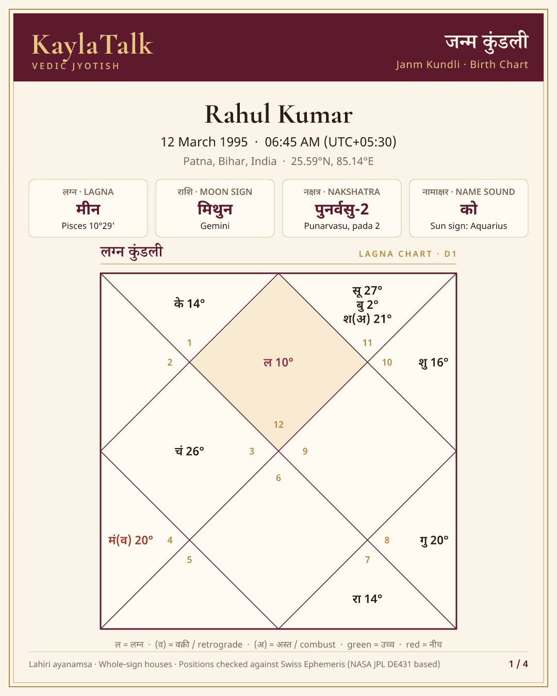
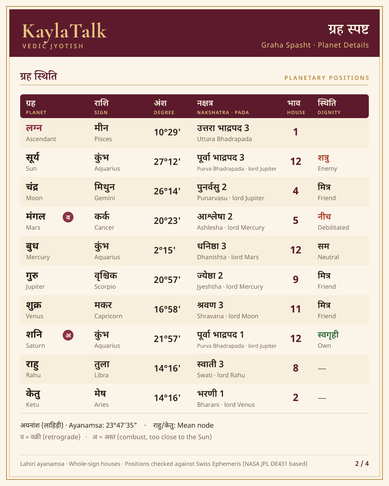
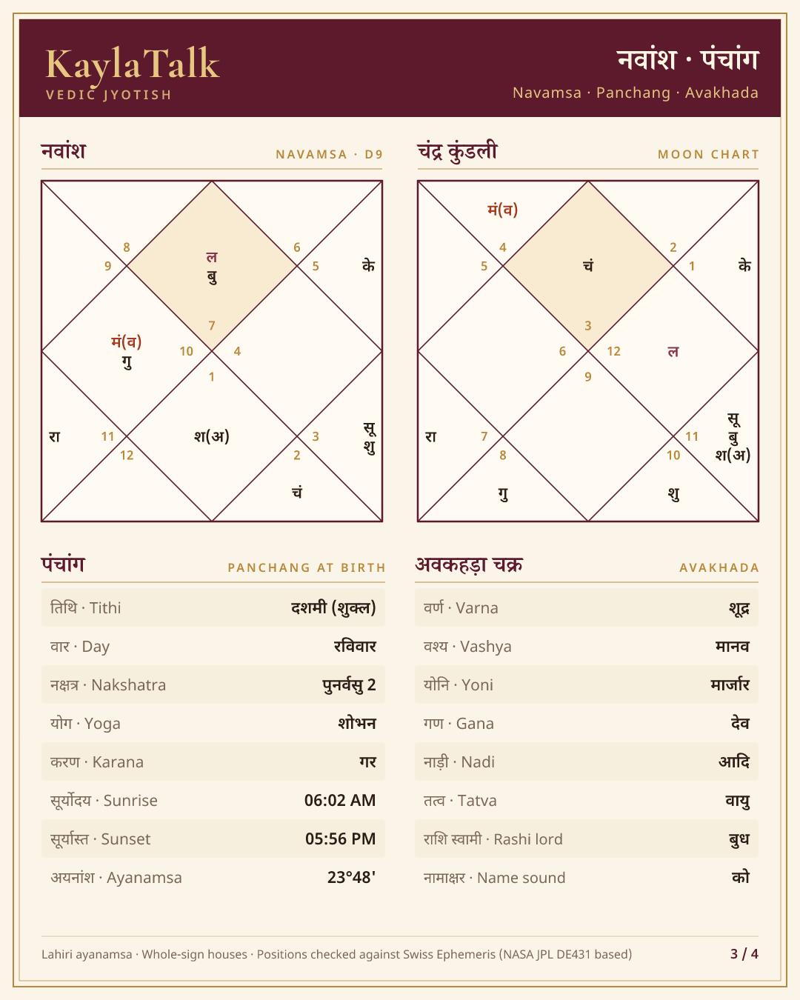
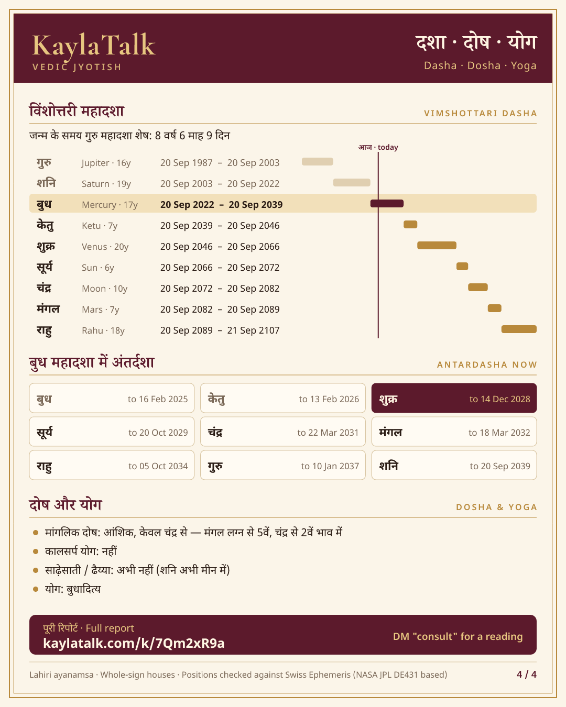

# KaylaTalk — Instagram DM se live kundli

Someone DMs the KaylaTalk Instagram account their **naam, janm tithi, samay aur sthan**.
The bot confirms the details, then replies within seconds with a **4-page professional
kundli** (images) and a link to the **full report** on kaylatalk.com.

| 1 · Lagna chart | 2 · Planet details | 3 · D9, panchang | 4 · Dasha, dosha |
|---|---|---|---|
|  |  |  |  |

## Conversation

```
User : Rahul Kumar, 12/03/1995, 6:45 am, Patna
Bot  : 🙏 Kripya details check kijiye:
       👤 Rahul Kumar  📅 12 March 1995  ⏰ 06:45 AM  📍 Patna, Bihar, India
       [✅ Haan, sahi hai] [✏️ Badlna hai]
User : ✅
Bot  : ✨ Rahul Kumar ji, aapki janm kundli taiyaar hai! 4 pages 👇
       [image] [image] [image] [image]
       📖 Poori report: https://www.kaylatalk.com/k/7Qm2xR9a
```

- Understands English, Hinglish and Hindi, labelled (`DOB: …`) or free text, Devanagari digits.
- **Never guesses**: asks AM/PM if missing, asks which Aurangabad (Bihar or Maharashtra), shows
  "12/03 = 12 March" in the confirmation, rejects future dates.
- Stays **silent on ordinary DMs**; it only starts on "kundli"/"कुंडली" or a message with birth details.
- "consult" → hands over to a human. "cancel" → stops. 3 kundlis per user per day (configurable).

## Comment auto-reply

Every new comment on a post or reel gets looked at, with the post's caption as context:

| Comment | What happens | AI cost |
|---|---|---|
| Birth details ("Riya 12/03/1995 6:45 am Patna") or "kundli banao" | Public reply "DM check kijiye 🙏" + **private DM** with their details as a ready-to-send line. Birth details are never repeated in public. | none |
| Emojis, "Jai Mata Di", "so true", "nice" | Warm thank-you (varied wording, so it doesn't look like a bot) | none |
| Anything else | Claude reads caption + comment and replies in the commenter's language (Hindi / Hinglish / English), ≤ 220 characters | 1 call |
| Personal question ("shaadi me deri kyu?") | Short public reply, no prediction in public + DM invite for a free kundli | 1 call |
| Criticism | Calm, non-defensive reply, flagged for the team | 1 call |
| Spam, links, abuse, "ignore your rules…" | No reply; abuse is flagged | 1 call |

Rules the replies follow: no guarantees, no fear about doshas, no death/illness/divorce predictions,
no medical/legal/financial advice, no prices, never claims to be human. At most 2 replies per
person per post per day. Every decision is logged in `kundliCommentLog` (30 days).

- `COMMENT_MODE=draft` logs the replies without posting, so the team can read a day of
  them before switching to `auto`.
- `BRAND_NOTES` adds facts about KaylaTalk (services, timings, what "consult" costs) the
  replies may use. Without it, replies never invent facts.
- Model: Claude Opus 5 at low effort, structured output, cached system prompt, with the
  server-side refusal fallback enabled (`fallbacks: "default"`), so a declined request is
  retried on another model instead of failing.

## Accuracy — how "precise" is verified

Planet positions come from [Astronomy Engine](https://github.com/cosinekitty/astronomy)
(MIT licence; its authors validate it against NASA JPL Horizons). On top of that we apply
light-time, aberration, IAU 2000B nutation, true obliquity and apparent sidereal time,
then the official Lahiri ayanamsa (23°15'00.658" at 21 Mar 1956, IAU 2006 precession).

`test/accuracy.test.js` checks **every planet, both nodes, the ascendant, ayanamsa, speeds and
the retrograde flag** for **500 random births (1900–2050, 18 cities including 69°N)** against
**Swiss Ephemeris 2.10**, the reference ephemeris used by professional astrology software,
which is fitted to NASA JPL's DE431. Worst deviation over all 500:

| Quantity | Worst | | Quantity | Worst |
|---|---|---|---|---|
| Sun | 2.1" | | Saturn | 12.5" |
| Moon | 11.8" | | Venus | 19.5" (near inferior conjunction) |
| Mercury | 8.9" | | Rahu (mean) | 0.12" |
| Mars | 10.5" | | Rahu (true) | 19.1" |
| Jupiter | 9.9" | | **Ascendant** | **6.4"** (even at 69°N) |

60" = 1 arc-minute; one nakshatra pada = 12,000". The Moon moves ~30" per minute of time,
so the engine's error is smaller than a one-minute uncertainty in the birth time.
Also tested: sunrise within 30 s, historical time zones (India's +6:30 war time of 1942–45,
Madras time before 1906, every DST change abroad), vaar changing at sunrise.

**Wording for marketing.** Say *"calculated with NASA JPL-based ephemeris data"* or
*"verified against NASA JPL-based Swiss Ephemeris"*. Don't say *"NASA verified"*: NASA
doesn't review or endorse astrology, and its name can't imply endorsement.

## ⚠️ Before going live: match your website's settings

A DM kundli that differs from the kundli on kaylatalk.com for the same person looks broken.
Check these against the site engine and set them to match:

| Setting | Default here | Where |
|---|---|---|
| Rahu/Ketu | **mean node** | `KUNDLI_NODE=mean` or `true` |
| Ayanamsa | Lahiri (Chitrapaksha) | `src/astro/positions.js` |
| Dasha year | 365.25 days | `DEFAULT_OPTIONS.dashaYearDays` in `src/kundli/index.js` |
| Manglik houses | 1, 2, 4, 7, 8, 12 (from lagna and Moon) | `DEFAULT_OPTIONS.manglikHouses` |
| Houses | whole sign | — |
| Moon moolatrikona | Taurus 3°–30° (exalted 0°–3°) | `src/astro/constants.js` (same fix as the site's shadbala.js) |

Easiest check: generate 5 kundlis on the site and 5 here (`node scripts/demo.js`, editing
the birth data) and compare lagna degree, Moon nakshatra-pada and current dasha.

## Places

Offline gazetteer, no API cost: GeoNames (171k places with state/district, CC BY 4.0) plus
country-state-city (148k). Handles old names (Bombay, Banaras, Allahabad, Gurgaon), state
short forms ("Hajipur Bihar", "Pratapgarh UP"), **Hindi script** (पटना, मुज़फ़्फ़रपुर, लखनऊ)
and typos (Muzzafarpur, Varansi). Small towns missing from both lists (e.g. Motihari)
fall back to **Google Geocoding** if you set `GOOGLE_GEOCODING_KEY`; without it the bot
asks for the nearest bigger town.

**Time zone comes from the country** where the country has a single zone. Coordinate-only
lookup is coarse at borders: it puts Moreh, Manipur in Asia/Yangon (+6:30), which would
shift the lagna by ~15°.

## Setup (Firebase, ~1 hour + Meta review time)

The code is a standalone Firebase Functions codebase. Copy this folder into the
KaylaTalk Firebase project (e.g. as `functions-kundli/`) and add it to `firebase.json`:

```json
{
  "functions": [{ "source": "functions-kundli", "codebase": "kundli-dm", "runtime": "nodejs22" }],
  "hosting": { "rewrites": [{ "source": "/k/**", "function": { "functionId": "kundliReport", "region": "asia-south1" } }] }
}
```

1. **Meta app** (developers.facebook.com): Instagram professional account → app with
   *Instagram API with Instagram Login* → permissions `instagram_business_basic`,
   `instagram_business_manage_messages`, `instagram_business_manage_comments`. Your existing
   posting app can be reused, but **DM and comment permissions need App Review** (privacy policy URL + screencast). Until approved it
   only works for accounts added as app testers, so **start this first**.
2. **Secrets**
   ```
   firebase functions:secrets:set IG_APP_SECRET        # Meta app secret
   firebase functions:secrets:set IG_VERIFY_TOKEN      # any random string
   firebase functions:secrets:set IG_ACCESS_TOKEN      # long-lived IG user token
   firebase functions:secrets:set ANTHROPIC_API_KEY    # for comment replies
   firebase functions:secrets:set GOOGLE_GEOCODING_KEY # optional
   ```
   Optional `.env`: `IG_API_BASE` (default `https://graph.instagram.com/v23.0`; set the
   current Graph API version), `IG_SENDER_ID` (`me`), `REPORT_BASE_URL`, `KUNDLI_NODE`, `BOT_MAX_PER_DAY`,
   `COMMENT_MODE` (`auto` | `draft`), `BRAND_NOTES`.
3. `npm install && npm test && firebase deploy --only functions:kundli-dm,hosting`
4. **Webhook** in the Meta app: callback URL = the `instagramWebhook` function URL, verify
   token = `IG_VERIFY_TOKEN`, subscribe to `messages` and `comments`.
5. **Firestore TTL policies** on field `expireAt` for collections `kundliReports`,
   `kundliDmInbox`, `kundliDmUsage`, `kundliCommentInbox`, `kundliCommentReplies`,
   `kundliCommentLog` so old data deletes itself (reports: 90 days).

If you use the Messenger-Platform flavour (Facebook Page linked) instead, set
`IG_API_BASE=https://graph.facebook.com/v23.0`, `IG_SENDER_ID=<PAGE_ID>` and a Page token.

## How it runs

```
Instagram ──webhook──▶ instagramWebhook   verify signature, queue message, 200 OK (<1 s)
                            │ kundliDmInbox/{mid}  (duplicate deliveries dropped)
                            ▼
                     processInstagramMessage  per-user lock → conversation
                            │ confirm ✅
                            ▼
      buildKundli → 4 SVG cards → PNG (HarfBuzz-shaped text, resvg) → Cloud Storage
                            │
                            └──▶ Send API: text + 4 images + report link
User taps link ──▶ kaylatalk.com/k/<id> ──▶ kundliReport (Firestore doc → HTML)
```

Generating one kundli (maths + 4 PNGs) takes ~0.3 s; the first message after a cold
start also loads the place index (~1.5 s).

## Privacy

Birth details are personal data (India's DPDP Act 2023). The first message tells users the
details are used only for the kundli; report links are unguessable (71-bit ids), `noindex`,
and expire after 90 days; sessions and counters expire too.

## Develop

```
npm install
npm test                    # 68 tests (accuracy, charts, parser, places, conversation, comments, end-to-end)
node scripts/demo.js        # writes out/card-1..4.png
```

`test/oracle/generate.py` regenerates the Swiss Ephemeris reference (needs `pyswisseph` and
the `.se1` data files). Swiss Ephemeris is AGPL/commercial, so it is used **only** to produce
the committed test fixture and is never part of the product.

## Not yet verified live

- Real Instagram Send/Webhook/comment-reply calls: tested with the documented payload shapes
  and a mocked `fetch`, not against Meta. First run with a tester account.
- Comment replies from Claude: the request is tested with a mocked client; no live API key was
  available here. Start with `COMMENT_MODE=draft` and read the log before going `auto`.
- `src/store/firestore.js`: not run against the emulator here. Test with `npm run serve`.
- Hindi schwa rule has known exceptions (सीतामढ़ी → "sitamrhi"); the typo matcher still finds them.

## Licences

Astronomy Engine (MIT), harfbuzzjs (MIT), resvg-js (MPL-2.0), tz-lookup (CC0),
country-state-city (GPL-3.0*), cities.json / GeoNames (CC BY 4.0), firebase-functions (MIT),
firebase-admin (Apache-2.0), fonts: Noto Sans/Serif Devanagari and Cormorant Garamond (SIL OFL 1.1).

\* GPL-3.0 applies when code is *distributed*; running it on your own server is not
distribution. If this code is ever shipped to others, drop that package (one `require` in
`src/dm/places.js`); GeoNames alone still covers 7,000+ Indian places.
